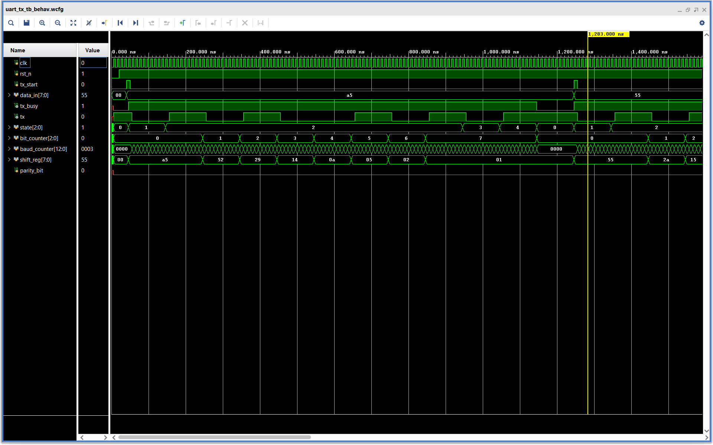
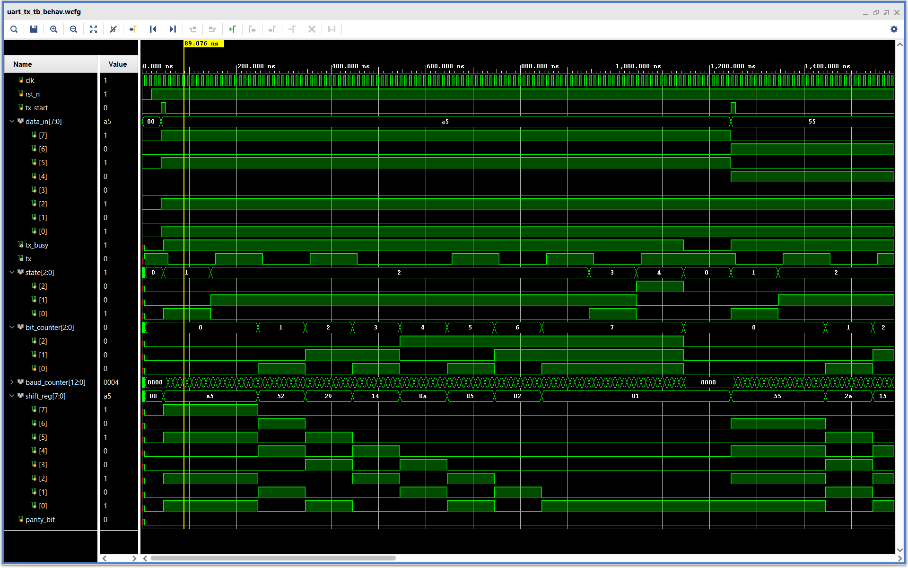

# UART Transmitter in Verilog

A parameterizable UART (Universal Asynchronous Receiver Transmitter) transmitter implemented in Verilog HDL featuring configurable baud rate, optional parity support, and a Finite State Machine (FSM) based architecture.

---

## Features

- Configurable clock frequency
- Configurable baud rate
- Optional parity support
- Even/Odd parity selection
- Finite State Machine (FSM) based implementation
- Parameterized design
- Shift-register based serialization
- Verilog testbench and waveform verification

---

## Specifications

| Parameter | Description |
|-----------|-------------|
| Data Width | 8 bits |
| Stop Bits | 1 |
| Parity | None / Even / Odd |
| Baud Rate | Configurable |
| Clock Frequency | Configurable |
| Architecture | FSM + Shift Register |

---

## UART Frame Formats Supported

### 8N1

```text
| Start | D0 | D1 | D2 | D3 | D4 | D5 | D6 | D7 | Stop |
```

### 8E1

```text
| Start | D0 | D1 | D2 | D3 | D4 | D5 | D6 | D7 | Parity | Stop |
```

---

## Finite State Machine (FSM)

```text
IDLE → START → DATA → PARITY → STOP → IDLE
```

---

## Project Structure

```text
uart-tx-verilog
├── rtl
│   └── uart_tx.v
├── tb
│   └── uart_tx_tb.v
├── waveforms
│   ├── uart_tx_overview.png
│   └── uart_tx_a5_8e1.png
├── docs
├── README.md
├── LICENSE
└── .gitignore
```

---

## Simulation Results

### Overview of UART Transmissions (A5 and 55)



### Transmission of `8'hA5` Using 8E1 Configuration



---

## Example Transmission

For:

```verilog
data_in = 8'hA5;
```

UART frame in **8E1** configuration:

```text
Start | Data (LSB First) | Parity | Stop
------------------------------------------------
0      | 1 0 1 0 0 1 0 1 |    0   | 1
```

---

## Tools Used

- Verilog HDL
- Xilinx Vivado 2025.1
- Vivado Simulator

---

## Future Improvements

- UART Receiver (RX)
- Configurable data width
- Configurable stop bits
- `tx_done` pulse generation
- UART loopback system
- FIFO buffering
- FPGA implementation on development boards

---

## Author

**Piyush Priyaranjan**

B.Tech in Electronics and Telecommunication Engineering  
Aspiring RTL and VLSI Design Engineer

---

## License

This project is licensed under the MIT License.